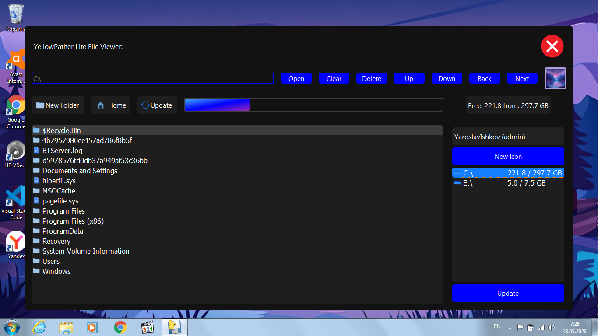

<<<<<<< HEAD


[](https://www.gnu.org/licenses/gpl-3.0)
[](https://www.python.org/)
[](https://pypi.org/project/PyQt5/)
[]()

> 🇷🇺 RU:

> 📄 Описание v1.0.1:
> Дорогие друзья (если таковые имеются) сегодня я бы хотел представить вам свой новый проект: YellowPather Lite, который в принципе является (неофициально) продолжением устаревшей программы YellowPather написаной на Tkinter, с использованием таких библиотек как: PyQt5 (интерфейс/графика), Psutil (работа с памятью), Screeninfo (получение размеров экрана). Я хотел сделать быстрый и удобный навигатор файлов, который по скорости в некоторых случаях обгонял родной (системный проводник). Данный проект распространяется под лицензией GPLv3 (GNU General Public License version 3), из-за использования PyQt5 (Open Source) а также юридической стороны Riverbank Computing Limited (разработчиков PyQt).


> 🔮 Что нового в версии v1.0.1:
> Исправлен баг с обновлением Memory Chunks при возвращении в диск после извлечения накопителя.


> 📖 Оглавление:
> 1. Инструкция по установке, работа приложения, проблемы и их решения.
> 2. Поддерживаемые системы (ОС).
> 3. Установка зависимостей.


> 📑 Раздел 1.1: Инструкция по установке:
> Перед тем как начать пользоваться нашим приложением, его конечно же нужно собрать в .exe, т.е сделать полноценное приложение из скачанного репозитория. Для этого нам понадобится Pyinstaller, или похожий упаковщик. Установить Pyinstaller можно при помощи менеджера пакетов pip, для этого в терминале кодового редактора нужно ввести команду:

> pip install pyinstaller

> После того как команда была введена, ждём установки зависимости.
Теперь приступим к упаковке (сборке) нашего приложения. Для этого откройте папку с репозиторием (yellowpather-lite), и найдите в ней файл с именем built.bat он то нам и поможет собрать приложение! Если вы открыли папку репозитория через редактор кода (IDE), то вам следует открыть данный файл через системный проводник. После того как мы его нашли, кликаем по нему быстро 2 раза, и перед нами должно появиться окно с терминалом (cmd32 на Windows), сборка приложения должна также начинаться автоматически.

> ЖдёмС когда сборка будет завершена и закрываем терминал (нажмите мышкой в любом месте).

> Всё! Теперь наше приложение полностью собрано, осталось только найти сам .exe файл в новой папке dist, и добавить по желанию в меню Пуск или же закрепить на панели задач.

> Если вы захотите внести свои изменения в приложение, перед сборкой обновления built.bat также следует изменить (пример добавления папки: --add-data "new folder;new folder", для UNIX систем используйте : вместо ;).

> Теперь приступим к изучению интерфейса!


> 📑 Раздел 1.2: Работа приложения:
> Я уже вам рассказывал что данное приложение предоставляется как быстрое и удобное решение для повседневных задач, связанных с папками или файлами, их открытием и исполнением. Да, пока что YellowPather Lite не умеет открывать самоисполняемые файлы из соображений безопасности, в будущем я планирую добавить флаг разрешенния для данной цели. Ладно, начинаем:

> 1. Первый элемент интерфейса который мы можем увидеть на рабочем окне приложения (не считая кнопки закрытия приложения), это строка или поле для ввода путей Path Entry. В нём мы можем ввести путь к папке или файлу. Можно вводить как относительный так и абсолютный путь к нужному объекту. При переходе между папками путь к текущему каталогу отображается в поле в виде плейсхолдера как подсказка для пользователя.

> 2. Вторым элементом интерфейса выступает Open - кнопка открытия объекта по указанному в строке пути. Если путь введёный пользователем в строке указывает на папку, будет открыт соответствующий каталог, если путь указывает на файл, то для его открытия будет использоваться системное приложение в зависимости от типа (расширения) файла (поддерживаемые расширения файлов: .txt, .html, .css, .png, .jpg, .jpeg, .gif, .bmp, .wepb, .doc, .docx, .flac, .wav, .mp3, .ogg, .log, .json).

> 3. Clear - кнопка очищения поля ввода.

> 4. Delete - кнопка удаления выделенного (текущего) элемента из списка файлов. Работает на данный момент только со списком файлов, планируется совместить кнопку с полем ввода (Будьте осторожны: папки, файлы удаляются безвозвратно, также планируется добавление окна с потверждением).

> 5. Up/Down - кнопки перемещения выделения в списке файлов, Up - перемещает выделение на один уровень выше (до самого верхнего элемента), Down - опускает выделение на один уровень ниже (до самого нижнего элемента).

> 6. Back/Next - кнопки перемещения (навигации) между папками, Next - перемещает пользователя в выделенную на данный момент папку в списке, Back возвращает пользователя в предыдущую папку (при достижении корневой директории пользователю отображается сообщение).

> 7. User Icon - иконка (аватарка) пользователя, которую можно изменить при помощи кнопки New Icon (см. пункт 14).

> 8. New Folder - кнопка создания новой папки по указанному в поле пути.

> 9. Home - кнопка возвращения пользователя в корневой каталог текущего диска.

> 10. Update (1) - кнопка обновления интерфейса: обновляет состояние (Memory Chunks), объём памяти (Memory State), список файлов (Context Menu), список дисков (Storage Menu).

> 11. Memory Chunks - прогрессбар отображения занятой и свободной памяти на диске.

> 12. Memory State - метка отображения объёма свободной памяти на диске, а также общий объём самого диска.

> 13. Context Menu - непосредственно сам список директорий и файлов.

> 14. User Name - метка с именем (никнеймом) пользователя и его статусом (если он администратор).

> 15. New Icon - кнопка замены иконки пользователя (поддерживаемые форматы изображений: .png, jpg/jpeg, .bmp, .webp).

> 16. Storage Menu (YPDM: YellowPather Drive Menu) - список подключенных на данный момент накопителей (встроенных хранилищ, SD/microSD, USB Flash), не поддерживает подключение по MTP (смартфоны и пр. устройства).

> 17. Update (2) - кнопка обновления списка дисков (не путать с кнопкой обновления интерфейса).


> 📑 Раздел 1.3: Проблемы и их решения:
> 1. Pyinstaller не может найти файл или зависимость: Убедитесь что имена всех папок из репозитория были добавлены через --add-data "folder;folder" с использованием соответствующего разделителя: ; - для Windows, : - для MacOS/Linux. Если не получается... ну запускайте прямо в редакторе, правда запускать его надо будет каждый раз.

> Изменено: готовые файлы теперь доступны во вкладке Releases.

> 2. Подключенный накопитель не отображается в Storage Menu: Данная проблема обычно связанна с тем что у подключенного накопителя нет прав на чтение или запись, если флешка конечно живая у вас вообще?. Проблема в большинстве случаев может возникать на UNIX - подобных системах (MacOS/Linux). Хотя приложение использует /proc/mounts для сканирования подключенных устройств, но не учитывает истинное расположение точек монтирования. На Windows проблема с обнаружением возникать не должна благодаря использованию ctypes/GetLogicalDrives(). Там проблема как раз таки с правами доступа. Решение: если вы используете SD накопитель, то на нём должен быть переключатель Lock, который и защищает накопитель от записи. Если он активен, отключите его и обновите список кнопкой Update. Проблема должна исчезнуть. Storage Menu отображает только диски доступные на данный момент. Работа с сетевыми томами не гарантирована, сам хз. Если вы используете флешку - используйте живую флешку :).


> 📑 Раздел 2.1: Поддерживаемые ОС:
> YellowPather Lite является кроссплатформенным приложением, поэтому оно поддерживается всеми основными системами:

> Windows: 7, 8, 10, 11 (в нашем случае Windows 7).
> MacOS (Нужно установить PyQt, Psutil).
> Linux (Проверяйте /proc/mounts, если работаете с дисками).

> Android: ? (не поддерживается).
> IOS: ? (не поддерживается).


> 📑 Раздел 3.1: Установка зависимостей:
> YellowPather Lite требует для работы следующие библиотеки:

> PyQt5 версии не ниже 5.15.
> Psutil версии не ниже 5.9.
> Screeninfo версии не ниже 0.8.

> Сам Python версии не ниже 3.8 (в нашем случае 3.8.10).

> Чтобы нам не пришлось загружать каждую библиотеку по отдельности, открываем терминал и вводим волшебную строку:

> pip install -r requirements.txt

> Заодно и версии последние загрузит.


> Гудбай, увидимся может быть ещё разок или пока.


> 🇬🇧 EN:

> 📄 Description v1.0.1:
> Dear friends (if any exist), today I would like to introduce you to my new project: YellowPather Lite. It is basically an (unofficial) continuation of the outdated Tkinter-based program YellowPather, using libraries such as PyQt5 (UI/graphics), Psutil (memory handling), and Screeninfo (getting screen dimensions). I wanted to create a fast and convenient file navigator that could sometimes outperform the native (system) file explorer. This project is distributed under the GPLv3 license (GNU General Public License version 3) due to the use of PyQt5 (Open Source) and the legal aspects of Riverbank Computing Limited (the developers of PyQt).


> 🔮 What's new in v1.0.1:
> Fixed a bug with updating Memory Chunks when returning to the drive after ejecting the drive.


> 📖 Table of Contents:
> 1. Installation instructions, application usage, issues and their solutions.
> 2. Supported systems (OS).
> 3. Installing dependencies.


> 📑 Section 1.1: Installation instructions:
> Before you can start using our application, you need to build it into an .exe — that is, turn the downloaded repository into a proper application. For this we'll need Pyinstaller or a similar packager. You can install Pyinstaller using the pip package manager by entering the following command in your code editor's terminal:

> pip install pyinstaller

> After entering the command, wait for the dependency to install.
Now let's proceed with packaging (building) our application. To do this, open the repository folder (yellowpather-lite) and find the file named built.bat — it will help us build the application! If you opened the repository folder through an IDE, you should open the file using the system file explorer. Once you've found it, double‑click it, and a terminal window (cmd32 on Windows) should appear. The application build should start automatically.

> Wait until the build is complete, then close the terminal (click anywhere with the mouse).

> That's it! Our application is now fully built. All that's left is to find the .exe file in the new `dist` folder and, if desired, add it to the Start menu or pin it to the taskbar.

> If you want to make your own changes to the application, you should also modify `built.bat` before building an update (example for adding a folder: `--add-data "new folder;new folder"`; for UNIX systems use `:` instead of `;`).

> Now let's start exploring the interface!


> 📑 Section 1.2: Application usage:
> I've already mentioned that this application is offered as a fast and convenient solution for everyday tasks involving folders or files, including opening and running them. Yes, for now YellowPather Lite cannot execute self‑executable files for security reasons; I plan to add an allowed flag for that purpose in the future. Anyway, let's begin:

> 1. The first interface element you'll see in the application window (not counting the close button) is the path input field, named **Path Entry**. Here you can enter a path to a folder or file. You can enter either a relative or absolute path to the desired item. When navigating between folders, the current directory's path is displayed in the field as a placeholder, acting as a hint for the user.

> 2. The second interface element is the **Open** button. It opens the object specified in the path field. If the entered path points to a folder, that directory will be opened. If it points to a file, the system's default application will be used to open it, depending on the file type (extension). Supported file extensions: .txt, .html, .css, .png, .jpg, .jpeg, .gif, .bmp, .webp, .doc, .docx, .flac, .wav, .mp3, .ogg, .log, .json.

> 3. **Clear** – button to clear the input field.

> 4. **Delete** – button to delete the currently selected item in the file list. Currently it only works on files in the list; I plan to integrate it with the input field as well. (Be careful: folders and files are deleted permanently. Adding a confirmation dialog is also planned.)

> 5. **Up/Down** – buttons to move the selection in the file list. Up moves the selection one level upward (to the topmost item), Down moves the selection one level downward (to the bottommost item).

> 6. **Back/Next** – navigation buttons for moving between folders. Next moves the user into the currently selected folder in the list. Back returns the user to the previous folder (when the root directory is reached, a message is shown).

> 7. **User Icon** – the user's avatar (icon), which can be changed using the **New Icon** button (see point 14).

> 8. **New Folder** – button to create a new folder at the path specified in the input field.

> 9. **Home** – button to return the user to the root directory of the current drive.

> 10. **Update (1)** – button to refresh the interface: updates the state (Memory Chunks), disk space (Memory State), file list (Context Menu), and disk list (Storage Menu).

> 11. **Memory Chunks** – a progress bar showing used and free space on the disk.

> 12. **Memory State** – a label displaying the amount of free space on the disk as well as the total capacity of the disk.

> 13. **Context Menu** – the actual list of directories and files.

> 14. **User Name** – a label with the user's name (nickname) and their status (if they are an administrator).

> 15. **New Icon** – button to replace the user icon (supported image formats: .png, .jpg/.jpeg, .bmp, .webp).

> 16. **Storage Menu (YPDM: YellowPather Drive Menu)** – a list of currently connected storage devices (internal drives, SD/microSD, USB flash drives). MTP (smartphones and similar devices) is not supported.

> 17. **Update (2)** – button to refresh the disk list (do not confuse it with the interface update button).


> 📑 Section 1.3: Issues and their solutions:
> 1. **Pyinstaller cannot find a file or dependency:** Make sure that all folder names from the repository have been added using `--add-data "folder;folder"` with the appropriate separator: `;` for Windows, `:` for macOS/Linux. If that doesn't work… well, just run it directly from the editor, though you’ll have to do that every time.

> Changed: Ready files are now available in the Releases tab.

> 2. **A connected storage device does not appear in Storage Menu:** This issue is usually related to the connected device lacking read or write permissions — assuming your flash drive is actually alive at all. The problem can often occur on Unix‑like systems (macOS/Linux). Even though the application uses `/proc/mounts` to scan for connected devices, it does not account for the true mount point locations. On Windows, detection issues shouldn't arise thanks to the use of `ctypes/GetLogicalDrives()`. There the problem is indeed related to access rights. **Solution:** If you're using an SD card, it may have a Lock switch that protects it from writing. If it is active, turn it off and refresh the list with the Update button. The problem should disappear. Storage Menu only displays currently available drives. Working with network volumes is not guaranteed — I don't know either. If you're using a flash drive, use a live one :)


> 📑 Section 2.1: Supported OS:
> YellowPather Lite is a cross‑platform application, so it is supported on all major systems:

> - **Windows:** 7, 8, 10, 11 (in our case, Windows 7).
> - **macOS:** (needs PyQt, Psutil installed).
> - **Linux:** (check `/proc/mounts` if you work with drives).

> - **Android:** ? (not supported).
> - **iOS:** ? (not supported).


> 📑 Section 3.1: Installing dependencies:
> YellowPather Lite requires the following libraries to run:

> - PyQt5 version not lower than 5.15.
> - Psutil version not lower than 5.9.
> - Screeninfo version not lower than 0.8.

> Python itself version not lower than 3.8 (in our case, 3.8.10).

> So we don't have to download each library individually, open the terminal and enter the magic line:

> pip install -r requirements.txt

> That will also load the latest versions.

> Goodbye, maybe we'll see each other again, or see you later.
=======
```markdown


[](https://www.gnu.org/licenses/gpl-3.0)
[](https://www.python.org/)
[](https://pypi.org/project/PyQt5/)
[]()

# 🇷🇺 Русская версия

## 📄 Описание (v1.0.1)

Дорогие друзья (если таковые имеются), сегодня я хотел бы представить вам свой новый проект: **YellowPather Lite**. Это (неофициальное) продолжение устаревшей программы YellowPather, написанной на Tkinter, с использованием библиотек:

- **PyQt5** — интерфейс и графика
- **Psutil** — работа с памятью
- **Screeninfo** — получение размеров экрана

Я хотел сделать быстрый и удобный навигатор по файлам, который по скорости в некоторых случаях обгонял бы системный проводник.  
Проект распространяется под лицензией **GPLv3** (GNU General Public License version 3) из-за использования PyQt5 (Open Source) и юридических аспектов Riverbank Computing Limited.

## 🔮 Что нового в v1.0.1

- Исправлен баг с обновлением Memory Chunks при возвращении на диск после извлечения накопителя.

## 📖 Оглавление

1. Инструкция по установке, работа приложения, проблемы и их решения.
2. Поддерживаемые системы (ОС).
3. Установка зависимостей.

---

## 📑 Раздел 1.1: Инструкция по установке

Перед использованием приложения его нужно собрать в `.exe` (или исполняемый файл для вашей ОС) из скачанного репозитория. Для этого понадобится **PyInstaller** (или аналогичный упаковщик).

### Установка PyInstaller

```bash
pip install pyinstaller
```

Сборка приложения

1. Откройте папку репозитория (yellowpather-lite).
2. Найдите файл built.bat и дважды кликните по нему (в Windows откроется cmd32 и автоматически начнётся сборка).
3. Дождитесь завершения и закройте терминал.
4. Готовый .exe файл появится в папке dist. Его можно добавить в меню «Пуск» или на панель задач.

Для внесения изменений: перед сборкой отредактируйте built.bat, добавив нужные папки через --add-data "папка;папка" (для Windows разделитель ;, для Linux/macOS — :).

---

📑 Раздел 1.2: Работа приложения

YellowPather Lite — быстрое и удобное решение для повседневных задач с папками и файлами. Пока не умеет запускать самоисполняемые файлы (в целях безопасности), но в будущем появится специальный флаг.

Элементы интерфейса

1. Path Entry — поле для ввода пути к папке или файлу (относительный или абсолютный). Текущий путь отображается как подсказка (placeholder).
2. Open — открывает объект по указанному пути:
   · если путь ведёт к папке → открывается каталог
   · если к файлу → открывается системным приложением (поддерживаются .txt, .html, .css, .png, .jpg, .jpeg, .gif, .bmp, .webp, .doc, .docx, .flac, .wav, .mp3, .ogg, .log, .json)
3. Clear — очищает поле ввода.
4. Delete — удаляет выделенный элемент из списка файлов (безвозвратно!).
5. Up / Down — перемещают выделение по списку файлов вверх/вниз.
6. Back / Next — навигация по папкам: Next — войти в выделенную папку, Back — вернуться назад.
7. User Icon — аватар пользователя (можно изменить через кнопку New Icon).
8. New Folder — создаёт новую папку по указанному в поле пути.
9. Home — переходит в корневой каталог текущего диска.
10. Update (1) — обновляет интерфейс: Memory Chunks, Memory State, список файлов, список дисков.
11. Memory Chunks — прогресс-бар занятой/свободной памяти на диске.
12. Memory State — метка с объёмом свободной памяти и общим объёмом диска.
13. Context Menu — список директорий и файлов.
14. User Name — имя пользователя и его статус (администратор или нет).
15. New Icon — замена иконки пользователя (поддерживаются .png, .jpg, .jpeg, .bmp, .webp).
16. Storage Menu (YPDM) — список подключённых накопителей (встроенные, SD/microSD, USB Flash). MTP (смартфоны) не поддерживается.
17. Update (2) — обновляет только список дисков (не путать с Update (1)).

---

📑 Раздел 1.3: Проблемы и их решения

1. PyInstaller не может найти файл или зависимость

Убедитесь, что все папки из репозитория добавлены через --add-data "папка;папка" с правильным разделителем:

· Windows — ;
· Linux/macOS — :

Важно: готовые исполняемые файлы теперь доступны во вкладке Releases.

2. Подключённый накопитель не отображается в Storage Menu

Причина обычно в отсутствии прав на чтение/запись.

· На Windows используется ctypes/GetLogicalDrives(), проблема редка.
· На Linux/macOS приложение сканирует /proc/mounts, но может не учитывать реальные точки монтирования.

Решение для SD-карт: проверьте переключатель Lock (защита от записи). Если он активен — отключите и нажмите Update.
Storage Menu показывает только доступные в данный момент диски. Работа с сетевыми томами не гарантирована.

---

📑 Раздел 2.1: Поддерживаемые ОС

YellowPather Lite — кроссплатформенное приложение:

ОС Поддержка
Windows 7, 8, 10, 11 ✅ полная
macOS ✅ (требует установки PyQt5, Psutil)
Linux ✅ (проверьте /proc/mounts для работы с дисками)
Android / iOS ❌ не поддерживается

---

📑 Раздел 3.1: Установка зависимостей

Требования:

· Python ≥ 3.8 (рекомендуется 3.8.10)
· PyQt5 ≥ 5.15
· Psutil ≥ 5.9
· Screeninfo ≥ 0.8

Все зависимости можно установить одной командой:

```bash
pip install -r requirements.txt
```

---

Гудбай, увидимся может быть ещё разок или пока.

---

🇬🇧 English Version

📄 Description (v1.0.1)

Dear friends (if any exist), today I would like to introduce you to my new project: YellowPather Lite. It is basically an (unofficial) continuation of the outdated Tkinter-based program YellowPather, using libraries such as:

· PyQt5 (UI/graphics)
· Psutil (memory handling)
· Screeninfo (getting screen dimensions)

I wanted to create a fast and convenient file navigator that could sometimes outperform the native system file explorer.
This project is distributed under the GPLv3 license (GNU General Public License version 3) due to the use of PyQt5 (Open Source) and the legal aspects of Riverbank Computing Limited.

🔮 What's new in v1.0.1

· Fixed a bug with updating Memory Chunks when returning to the drive after ejecting the drive.

📖 Table of Contents

1. Installation instructions, application usage, issues and their solutions.
2. Supported systems (OS).
3. Installing dependencies.

---

📑 Section 1.1: Installation instructions

Before using the application, you need to build it into an executable file from the downloaded repository. You'll need PyInstaller (or a similar packager).

Installing PyInstaller

```bash
pip install pyinstaller
```

Building the application

1. Open the repository folder (yellowpather-lite).
2. Find the built.bat file and double-click it (on Windows, cmd32 will open and the build will start automatically).
3. Wait for completion and close the terminal.
4. The built .exe file will appear in the dist folder. You can pin it to the Start menu or taskbar.

Making changes: edit built.bat before building, adding folders via --add-data "folder;folder" (separator ; for Windows, : for Linux/macOS).

---

📑 Section 1.2: Application usage

YellowPather Lite is a fast and convenient solution for everyday tasks with folders and files. For security reasons, it cannot run self-executable files yet, but a permission flag is planned.

Interface elements

1. Path Entry — input field for a folder or file path (relative or absolute). The current path is shown as a placeholder.
2. Open — opens the object:
   · folder → opens the directory
   · file → opens with the default system application (supports .txt, .html, .css, .png, .jpg, .jpeg, .gif, .bmp, .webp, .doc, .docx, .flac, .wav, .mp3, .ogg, .log, .json)
3. Clear — clears the input field.
4. Delete — deletes the selected item from the file list (permanently!).
5. Up / Down — move selection up/down in the file list.
6. Back / Next — folder navigation: Next enters the selected folder, Back returns to the previous one.
7. User Icon — user avatar (change via New Icon button).
8. New Folder — creates a new folder at the path shown in the input field.
9. Home — goes to the root directory of the current drive.
10. Update (1) — refreshes the interface: Memory Chunks, Memory State, file list, disk list.
11. Memory Chunks — progress bar showing used/free disk space.
12. Memory State — label with free and total disk space.
13. Context Menu — list of directories and files.
14. User Name — user name and admin status.
15. New Icon — changes the user icon (supports .png, .jpg, .jpeg, .bmp, .webp).
16. Storage Menu (YPDM) — list of connected drives (internal, SD/microSD, USB Flash). MTP (smartphones) is not supported.
17. Update (2) — refreshes only the disk list (not to be confused with Update (1)).

---

📑 Section 1.3: Issues and their solutions

1. PyInstaller cannot find a file or dependency

Make sure all folders from the repository are added via --add-data "folder;folder" with the correct separator:

· Windows — ;
· Linux/macOS — :

Note: ready-made executables are now available in the Releases tab.

2. A connected storage device does not appear in Storage Menu

Usually caused by missing read/write permissions.

· On Windows ctypes/GetLogicalDrives() is used, so issues are rare.
· On Linux/macOS the app scans /proc/mounts but may not account for actual mount points.

Solution for SD cards: check the Lock switch (write protection). If it is active, turn it off and press Update.
Storage Menu shows only currently available drives. Network volumes are not guaranteed to work.

---

📑 Section 2.1: Supported OS

YellowPather Lite is cross-platform:

OS Support
Windows 7, 8, 10, 11 ✅ full
macOS ✅ (requires PyQt5, Psutil installed)
Linux ✅ (check /proc/mounts for drive access)
Android / iOS ❌ not supported

---

📑 Section 3.1: Installing dependencies

Requirements:

· Python ≥ 3.8 (recommended 3.8.10)
· PyQt5 ≥ 5.15
· Psutil ≥ 5.9
· Screeninfo ≥ 0.8

Install all dependencies with:

```bash
pip install -r requirements.txt
```

---

Goodbye, maybe we'll see each other again, or see you later.

```
>>>>>>> 9db1981 (Fixed README.md)
